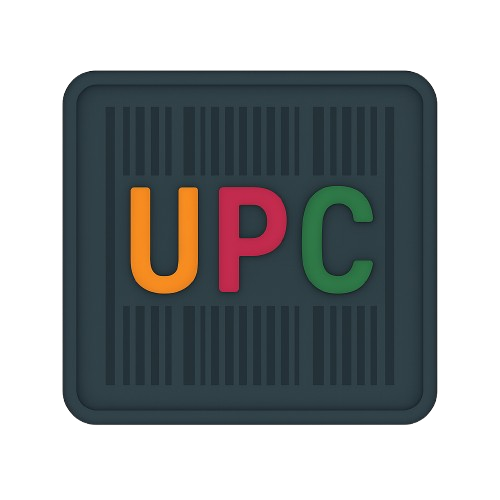

# UPC Notepad — Professional Text Editor



A fully-featured, modular text editor built with **PyQt6**. It has been modernized from a single-file script into a clean, professional application architecture suitable for production and easy distribution.

---

## 🌟 Features

- **Multi-Tab Interface:** Edit multiple files concurrently with smart tab management and unsaved-changes protection.
- **Syntax Highlighting:** Real-time syntax highlighting for Python, JSON, HTML, CSS, JavaScript, SQL, and Markdown with a beautiful Monokai-inspired color palette.
- **SQLite Database Integration:**
  - **Snippets Manager:** Save bits of code or text directly into the local database and load them anytime in a new tab.
  - **Persistent Settings:** Safely stores your preferences (theme, recent files, window size).
- **Text-to-Speech & MP3 Export:** 
  - Reads text aloud with automatic fallback to `pyttsx3` if system TTS is unavailable.
  - Asynchronous background MP3 export using `gTTS` with a live progress bar.
- **Professional Editor Tools:**
  - Line Numbers & Current Line Highlighting.
  - Non-modal, inline Find & Replace bar (Case-Sensitive, Whole-Word).
  - Smart indentation, Duplicate Line (`Ctrl+D`), Toggle Comments (`Ctrl+/`), and Go to Line (`Ctrl+G`).
  - Zoom In/Out (`Ctrl+MouseWheel`).
- **Comprehensive Theming:** True application-wide Dark and Light themes utilizing custom QSS stylesheets.
- **Status Bar:** Real-time line/column indicator, word/char counts, file encoding, and language mode.

---

## 🏗️ Architecture

The application is structured following modern software engineering principles:

```text
src/
├── app.py              # App bootstrap and setup
├── main_window.py      # Main UI shell (menus, tabs, toolbars)
├── config/             # App Constants and SQLite Settings Manager
├── core/               # Document models, Database, and File I/O
├── editor/             # CodeEditor, Highlighter, LineNumberArea, TabManager
├── features/           # FindReplace, Screenshot, threaded TTSEngine, Statistics
├── ui/                 # Status bar, ThemeManager (QSS loader)
└── utils/              # Path resolution (PyInstaller compatible) & Logger
```

---

## 🚀 Installation (Source)

1. **Clone the repository:**
   ```bash
   git clone https://github.com/yourusername/upc-notepad.git
   cd upc-notepad
   ```
2. **Install requirements:**
   ```bash
   pip install -r requirements.txt
   ```
3. **Run the application:**
   ```bash
   python main.py
   ```

---

## 📦 Building an Executable

You can easily package UPC Notepad into a standalone executable that you can share with others using PyInstaller.

1. Install PyInstaller (included in `requirements.txt`):
   ```bash
   pip install pyinstaller
   ```
2. Build the application:
   ```bash
   pyinstaller --noconfirm --onedir --windowed --add-data "resources:resources" --icon "resources/icons/upc.png" --name "UPC_Notepad" main.py
   ```
3. Your executable will be available in the `dist/UPC_Notepad/` folder! You can zip this folder and share it with anyone.

*(Note: On Windows, use `--add-data "resources;resources"` instead of `:`)*

---

## 🧪 Testing

The core functionality (Document model, File I/O, SQLite manager) is fully unit-tested using `pytest`.

To run the tests:
```bash
pytest tests/
```
